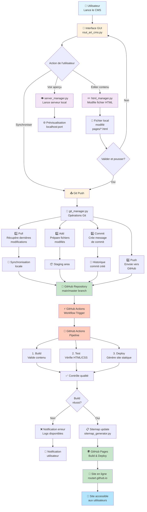
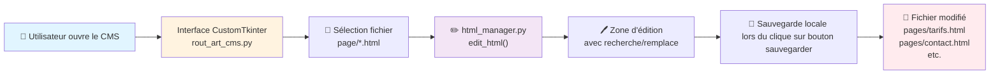
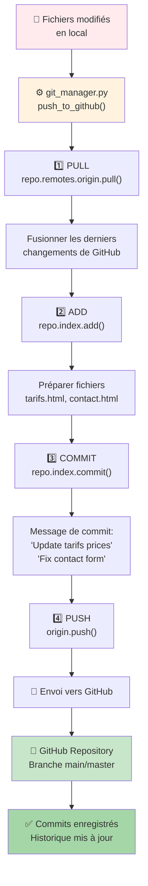
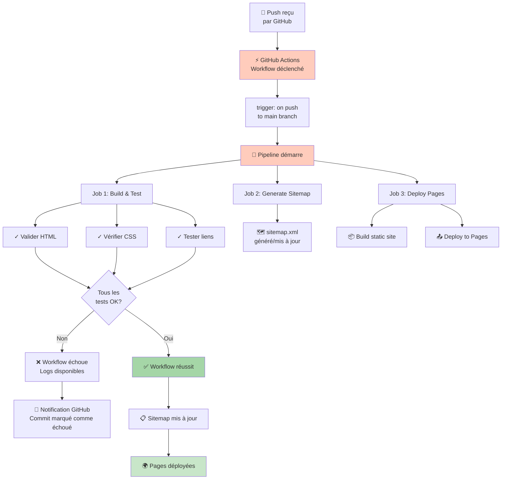
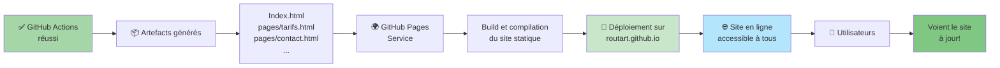
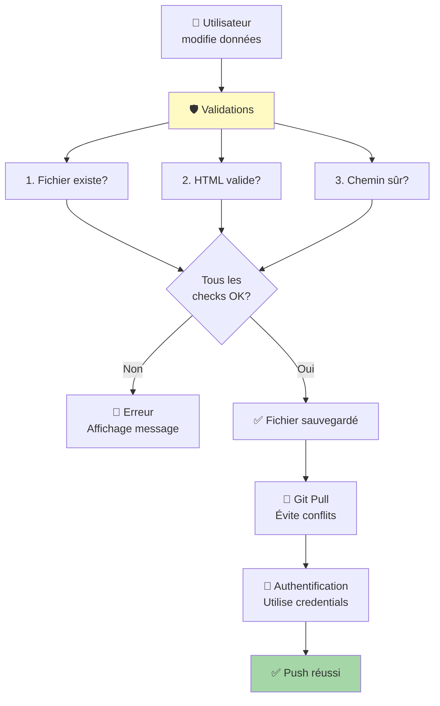

# 📊 Diagramme de Flux: CMS → GitHub Pages via GitHub Actions

## Vue d'ensemble du processus



---

## 📊 Flux détaillé étape par étape

### **Phase 1: Édition dans le CMS (Local)**



### **Phase 2: Synchronisation Git (Local → GitHub)**



### **Phase 3: Déclenchement GitHub Actions**



### **Phase 4: Déploiement GitHub Pages**



---

## 📋 Tableau Récapitulatif

| Phase | Composant            | Action                  | Entrée                  | Sortie                  |
| ----- | -------------------- | ----------------------- | ----------------------- | ----------------------- |
| **1** | CMS GUI              | Éditer fichiers HTML    | Fichiers locaux         | Fichiers modifiés       |
| **2** | html_manager.py      | Lire/écrire HTML        | Changements utilisateur | Fichiers .html modifiés |
| **3** | server_manager.py    | Serveur local optionnel | Port configuré          | Prévisualisation locale |
| **4** | git_manager.py       | Pull/Add/Commit/Push    | Fichiers modifiés       | Commits sur GitHub      |
| **5** | GitHub Actions       | Build & Test            | Commits reçus           | Logs + Rapports         |
| **6** | sitemap_generator.py | Générer sitemap.xml     | Structure HTML          | sitemap.xml mis à jour  |
| **7** | GitHub Pages         | Déploiement             | Fichiers générés        | Site en ligne           |

---

## 🔄 Flux Complet: Exemple Concret

### Scénario: Mise à jour des tarifs

```
1. Utilisateur ouvre CMS
   ↓
2. Sélectionne "page/tarifs.html"
   ↓
3. Modifie prix: "70€" → "75€"
   ↓
4. Clique "Synchroniser avec GitHub"
   ↓
5. CMS exécute:
   - git pull (obtient derniers changements)
   - git add pages/tarifs.html (prépare fichier)
   - git commit -m "Update tarif inscription: 70€ → 75€" (crée commit)
   - git push (envoie vers GitHub)
   ↓
6. GitHub reçoit le push
   ↓
7. Actions déclenchées:
   - Valide HTML/CSS
   - Teste liens
   - Génère sitemap
   - Déploie sur Pages
   ↓
8. routart.github.io mis à jour ✅
   ↓
9. Utilisateurs voient les nouveaux tarifs!
```

---

## 🔐 Points de Sécurité & Validation



---

## 🎯 Architecture Résumée

```
┌─────────────────────────────────────────────────────────┐
│                    LOCAL MACHINE                         │
│                                                           │
│  ┌──────────────────────────────────────────────────┐   │
│  │        ROUT'ART CMS (CustomTkinter GUI)          │   │
│  │                                                   │   │
│  │  ┌─────────────────────────────────────────┐    │   │
│  │  │   rout_art_cms.py (Main Application)   │    │   │
│  │  └─────────────────────────────────────────┘    │   │
│  │           ↓                    ↓                  │   │
│  │    ┌──────────────┐    ┌─────────────────┐     │   │
│  │    │html_manager  │    │server_manager   │     │   │
│  │    │(Edit HTML)   │    │(Local Preview)  │     │   │
│  │    └──────────────┘    └─────────────────┘     │   │
│  │           ↓                                      │   │
│  │    ┌──────────────────────────────────────┐    │   │
│  │    │    git_manager.py (Git Sync)        │    │   │
│  │    │  Pull → Add → Commit → Push         │    │   │
│  │    └──────────────────────────────────────┘    │   │
│  └──────────────────────────────────────────────────┘   │
│                      ↓                                    │
│            Local Git Repository                          │
│     (pages/tarifs.html, pages/contact.html...)          │
└─────────────────────────────────────────────────────────┘
          ↓ git push via HTTPS/SSH
┌─────────────────────────────────────────────────────────┐
│              GITHUB REPOSITORY                          │
│          (github.com/user/repo)                         │
│                                                           │
│  - Fichiers source (pages/*.html)                       │
│  - Commit history                                        │
│  - GitHub Actions Workflows                             │
└─────────────────────────────────────────────────────────┘
          ↓ Webhook: on push to main
┌─────────────────────────────────────────────────────────┐
│              GITHUB ACTIONS                             │
│        (Automated CI/CD Pipeline)                       │
│                                                           │
│  1. Build & Test                                         │
│  2. Generate sitemap_generator.py                       │
│  3. Deploy to Pages                                      │
└─────────────────────────────────────────────────────────┘
          ↓ Auto-deploy
┌─────────────────────────────────────────────────────────┐
│           GITHUB PAGES (Hosting)                        │
│        (routart.github.io - Public Site)                │
│                                                           │
│  - Site statique en ligne                              │
│  - Contenu à jour                                       │
│  - sitemap.xml généré                                  │
└─────────────────────────────────────────────────────────┘
          ↓
┌─────────────────────────────────────────────────────────┐
│              PUBLIC USERS                               │
│        Visitent et voient le site à jour ✅              │
└─────────────────────────────────────────────────────────┘
```

---

## ⚙️ Configuration GitHub Actions (Exemple)

```yaml
name: CI/CD Pipeline

on:
  push:
    branches: [ main, master ]

jobs:
  build-and-deploy:
    runs-on: ubuntu-latest
    
    steps:
    - uses: actions/checkout@v3
    
    - name: Validate HTML
      run: |
        # Validation des fichiers HTML
        for file in page/*.html; do
          echo "Validating $file"
        done
    
    - name: Generate Sitemap
      run: |
        python3 -m cms.source.sitemap_generator
    
    - name: Deploy to GitHub Pages
      uses: peaceiris/actions-gh-pages@v3
      with:
        github_token: ${{ secrets.GITHUB_TOKEN }}
        publish_dir: ./
```

---

## 🎓 Résumé du Flux Complet

```
CMS USER EDIT
    ↓
LOCAL FILE MODIFIED (HTML)
    ↓
GIT COMMIT PUSHED
    ↓
GITHUB RECEIVES PUSH
    ↓
GITHUB ACTIONS TRIGGERED
    ↓
BUILD & TEST & SITEMAP
    ↓
GITHUB PAGES DEPLOY
    ↓
LIVE SITE UPDATED ✅
    ↓
USERS SEE NEW CONTENT 🎉
```
